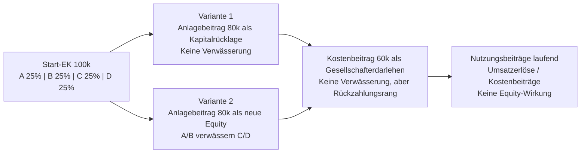
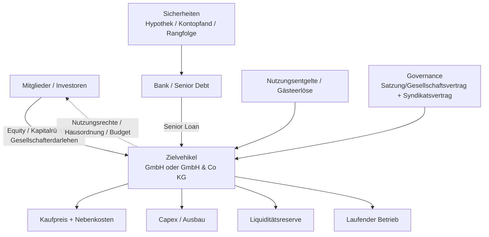

# Vergleich des Finanzierungsentwurfs mit den Beitragsmodellen und den geeigneten Rechtsformen nach österreichischem Recht

## Executive Summary

Der zugängliche Finanzierungsentwurf beschreibt wirtschaftlich ein immobiliennahes Gemeinschaftsprojekt mit gemischten Elementen aus Anschaffung, Ausbau, laufender Nutzung und möglicher Gästevermietung. Er kalkuliert mit einem Kaufpreis von rund **715.000 Euro**, Nebenkosten von rund **67.210 Euro**, zusätzlichen Investitionen von rund **135.000 Euro** und damit einem Gesamtvolumen von etwa **915.000 Euro**. Zugleich arbeitet der Entwurf mit mehreren Beitragsarten, die **wirtschaftlich sehr unterschiedlich** sind: Start-Eigenkapital, Anlagebeiträge, Kostenbeiträge, Nutzungsbeiträge und eine Liquiditätsreserve. Genau hier liegt die zentrale Schwäche des aktuellen Drafts: Die Beiträge sind wirtschaftlich benannt, aber **rechtlich und bilanziell noch nicht sauber typisiert**. Genau das entscheidet jedoch über **Dilution, Rückzahlbarkeit, Rang, Sicherheiten, Steuerfolgen, Ausschüttungsfähigkeit und Exit**. fileciteturn0file0

Für ein solches Projekt ist ein **Verein** regelmäßig die schwächste Struktur, weil das Vereinsrecht einen **ideellen Zweck** verlangt und die Mitgliedschaft keine echte Equity mit sauber handelbaren Investor-Rechten darstellt. Die Formen **AG** und **Privatstiftung** sind demgegenüber für ein Volumen in dieser Größenordnung meist **überstrukturiert**: rechtlich sauber, aber teuer, formalistisch und für ein kleines geschlossenes Konsortium unnötig schwer. Die beste Passung liegt regelmäßig bei einer **GmbH** oder — wenn Gewinn-, Verlust- und Nutzungsrechte bewusst flexibler verteilt werden sollen — bei einer **GmbH & Co KG**. Direkte private Miteigentümerschaft kann zwar anfangs simpel wirken, ist aber für Governance, Nachfinanzierung, Anteilsübertragungen und spätere Konflikte typischerweise die konfliktträchtigste Lösung. citeturn24view9turn24view10turn37view7turn31view0turn37view6turn34search0

Aus Sicht des Draftings sollte der Entwurf auf **vier Schienen** getrennt werden: **echtes Eigenkapital**, **Gesellschafterdarlehen/Nachrangmittel**, **laufende Nutzungsentgelte** und **echte Betriebskostenumlagen**. Diese vier Schienen dürfen nicht mehr vermischt werden. Nur dann wird die Finanzierung bankfähig, steuerlich beherrschbar und gesellschaftsrechtlich belastbar. Für die Umsatzsteuer ist besonders wichtig, dass private Nutzung, Wohnzweck-Vermietung, Beherbergung und kurzfristige Vermietung **nicht dieselbe steuerliche Behandlung** haben. Das BMF verweist ausdrücklich darauf, dass bestimmte Vermietungen steuerfrei sein können, Wohnzweck-Vermietungen und Hotelbeherbergung mit **10 %** zu versteuern sind und bestimmte kurzfristige Vermietungen mit **20 %**; außerdem kann nichtunternehmerische Nutzung Vorsteuerfragen und Eigenverbrauchstatbestände auslösen. citeturn17view1turn22view10turn21view9turn23view4

Der wichtigste praktische Befund lautet deshalb: **Die Endstruktur muss vor dem Erwerb des Objekts feststehen.** Wird zunächst privat gekauft und später in eine Gesellschaft übertragen, drohen zusätzliche Reibungen bei **Grunderwerbsteuer, Grundbuch, Notar/Anwalt und Finanzierung**. Österreichische amtliche Informationen weisen bereits für den Erstkauf auf Grunderwerbsteuer, Grundbuchsgebühr und weitere Erwerbsnebenkosten hin; spätere Eigentumsübertragungen sind daher keine bloß formale Umhängung, sondern wirtschaftlich relevant. citeturn17view0turn38search2

## Quellenlage und Annahmen

Diese Ausarbeitung stützt sich auf den **zugänglichen Projektentwurf** in der Datei `2026-06-05_finanzierungsidee_steuer-bankberater.md` sowie auf **österreichische Primärquellen** und **amtliche Guidance**. Der zugängliche Entwurf nennt die zentralen Kostenblöcke und Beitragskategorien, weist aber nicht für alle Beiträge eine personenscharfe Zuordnung, einen festen Betrag, eine klare Rangfolge oder einen finalen bilanziellen Charakter aus. Wo der Entwurf offen bleibt, arbeite ich mit **expliziten Annahmen** und kennzeichne diese als solche. fileciteturn0file0

Ich interpretiere „private share ownership“ für die österreichische Einordnung als **direktes privates Miteigentum an der Liegenschaft**, praktisch oft kombiniert mit einer **GesbR-/Syndikatslogik**. Das ist deshalb sachgerecht, weil bei einem kleinen Immobilienprojekt die realen Alternativen typischerweise nicht „private Aktien“ im gesellschaftsrechtlichen Sinn sind, sondern entweder **direktes Miteigentum**, eine **Personengesellschaft**, eine **Kapitalgesellschaft** oder ein **Verein/Stiftungskonstrukt**. Für das österreichische Miteigentum und die GesbR-Struktur habe ich mangels frei zugänglicher RIS-Volltexte für das ABGB ergänzend auf allgemein anerkannte Sekundärdarstellungen zurückgegriffen; die tragenden Aussagen dieses Berichts beruhen aber überwiegend auf RIS, BMF, WKO, FMA, USP und oesterreich.gv.at. citeturn15search0turn33search2turn17view0turn17view1turn31view0turn36view2

Soweit der Draft eine Fremdfinanzierung von rund **450.000 Euro** erwähnt, behandle ich diesen Wert als **Debt-Korridor bzw. intendierte Bankfinanzierung**, nicht als bereits vollständig dokumentierten und final zugesagten Kreditbetrag. Genau diese Unschärfe ist einer der Punkte, die im nächsten Draft beseitigt werden müssen. fileciteturn0file0

## Finanzierungsbeiträge im zugänglichen Entwurf

Aus dem zugänglichen Entwurf lassen sich die folgenden Finanzierungsbausteine extrahieren. Entscheidend ist dabei weniger die wirtschaftliche Bezeichnung als die **rechtliche Typisierung**, weil dieselbe Zahlung je nach Gestaltung bilanziell als Eigenkapital, Kapitalrücklage, Darlehen, Betriebsertrag oder Kostenersatz behandelt werden kann. fileciteturn0file0

| Beitragsbaustein | Betrag laut zugänglichem Entwurf | Wirtschaftlicher Charakter | Rechtlich/bilanziell sinnvollste Typisierung | Zeitliche Einordnung | Dilution-/Bewertungswirkung | Steuer-/Reporting-Hinweis |
|---|---:|---|---|---|---|---|
| Kaufpreis Liegenschaft | ca. 715.000 € | Anschaffung des Kernassets | Aktivierung als Grundstück/Gebäude im Zielvehikel | Closing | keine direkte Dilution, aber Basis des Kapitalbedarfs | Erwerbsnebenkosten zusätzlich; bei Immobilienkauf fallen typischerweise GrESt, Grundbuch und Vertragskosten an. fileciteturn0file0 citeturn17view0 |
| Erwerbsnebenkosten | ca. 67.210 € | Transaktionskosten | Aktivierung/Anschaffungsnebenkosten je nach Art | Closing | keine direkte Dilution | Amtliche Richtwerte: GrESt grundsätzlich 3,5 %, Grundbuch 1,1 %, Notar/Anwalt ungefähr 1–3 %. fileciteturn0file0 citeturn17view0 |
| Zusatzinvestitionen | ca. 135.000 € | Ausbau/Einrichtung/Sicherheitspuffer | Aktivierbare Investitionen bzw. Instandsetzung je nach Maßnahme | Post-Closing / Bauphase | nur wenn als Eigenkapital finanziert | Ohne klare Zuordnung droht Vermischung von Equity, Zuschuss und Betriebskosten. fileciteturn0file0 |
| Start-EK | ca. 100.000 € | Basis-Eigenmittel | **Stammkapital / Einlagekapital** oder bei KG **Kapitalkonten** | vor bzw. bei Gründung/Closing | ja, wenn echte Equity | Sollte die Referenzgröße für die Ausgangs-Cap-Table sein. fileciteturn0file0 |
| Anlagebeitrag | ca. 80.000 € | wertsteigernder Sonderbeitrag | Entweder **Kapitalrücklage/Nachschuss** oder **Gesellschafterdarlehen**; nur ausnahmsweise Betriebskostenerstattung | einmalig, investitionsbezogen | nur bei expliziter Umwandlung in Equity | Bei GmbH müssen nicht in Geld bestehende wiederkehrende Leistungen und Vergütungslogik im Gesellschaftsvertrag sehr genau beschrieben werden. fileciteturn0file0 citeturn24view8 |
| Kostenbeitrag | ca. 60.000 € | Sonderlast/Kostenumlage | Nur dann Equity, wenn ausdrücklich so beschlossen; sonst **echte Umlage** oder **Darlehen** | je nach Bau-/Nutzungsphase | offen; derzeit unklar | Ohne Typisierung ist unklar, ob dieser Beitrag Eigentumsquoten erhöht oder nur Kosten deckt. fileciteturn0file0 |
| Nutzungsbeitrag | Betrag im Entwurf nicht abschließend fixiert | laufender, nutzungsabhängiger Beitrag | **Umsatzerlös / Nutzungsentgelt / Service Fee**, nicht Equity | laufend | grundsätzlich keine Dilution | Umsatzsteuerlich nur sauber beherrschbar, wenn die Leistung präzise definiert ist. Je nach Qualifikation kommen 10 % oder 20 % in Betracht; gemischte Privatnutzung ist heikel. fileciteturn0file0 citeturn17view1turn21view9turn22view10 |
| Liquiditätsreserve | ca. 20.000 € | Working Capital / Puffer | **Kapitalrücklage** oder **nachrangiges Gesellschafterdarlehen** | vor Eröffnung/laufend | nur bei Equity | Sauber vom Investitionsbudget trennen; sonst wird die Kapitalbedarfsrechnung unklar. fileciteturn0file0 |
| Bankdarlehen | im Entwurf erkennbar, Größenordnung ca. 450.000 € als Annahme | Senior Debt / Objektfinanzierung | Bankdarlehen mit Hypothek, ggf. Gesellschaftergarantien | Closing / Baufortschritt | keine Dilution | Nach Ende der KIM-V bleiben 90 % LTV, 40 % Schuldendienstquote und 35 Jahre Laufzeit FMA-Richtwerte für private Wohnimmobilienkredite; bei SPV-Finanzierungen läuft die Prüfung praktisch oft objekt-/unternehmensbezogen. fileciteturn0file0 citeturn36view2turn36view3 |
| Grant/Zuschuss | keiner identifiziert | — | — | — | — | Im zugänglichen Material kein Zuschussbaustein erkennbar. fileciteturn0file0 |

Der Entwurf ist damit **ökonomisch plausibel**, aber noch **nicht closing-fähig**, weil die Begriffe „Beitrag“, „Kosten“, „Nutzung“ und „Kapital“ noch nicht deckungsgleich mit den späteren Konten, Ansprüchen und Rangstufen sind. Besonders heikel ist, dass ein **Anlagebeitrag** entweder Eigentum erhöhen, rückzahlbar sein, verzinslich sein oder bloß einen Bauaufwand abdecken kann. Das sind vier verschiedene Rechts- und Bilanzfolgen. fileciteturn0file0

Soweit man die im Entwurf sichtbaren Beträge streng addiert, spricht viel dafür, dass zwischen Gesamtinvestition und vollständig fest verdrahteten Finanzierungsquellen **noch eine Lücke oder zumindest eine Definitionslücke** besteht. Diese kann nur durch eine harte **Sources-and-Uses-Tabelle** geschlossen werden, in der jede Zahlung genau einem Konto, Rang, Zweck und Rückzahlungsmechanismus zugeordnet wird. fileciteturn0file0

### Cap-Table-Evolution in einer belastbaren Modelllogik

Das folgende Diagramm zeigt, warum der Draft eine klare Trennung zwischen Equity, Zuschuss und Darlehen braucht. Die Zahlen sind eine **Arbeitsannahme** zur Illustration: vier Gründer A–D, Start-EK insgesamt 100.000 €, Anlagebeitrag 80.000 € nur von A und B, Kostenbeitrag 60.000 € als Gesellschafterdarlehen, Liquiditätsreserve 20.000 € als Kapitalrücklage. Die **Eigentumsquoten bleiben nur dann stabil**, wenn Sonderbeiträge nicht in neue Equity umgewandelt werden. fileciteturn0file0

## Vergleich der Rechtsformen nach österreichischem Recht

Die passende Rechtsform hängt hier nicht nur von Haftung und Steuern ab, sondern vor allem davon, ob die Beiträge **investorisch**, **nutzungsbezogen** oder **gemeinschaftsbezogen** sein sollen. Genau deshalb reicht eine Standard-Gesellschaftsform alleine nicht; die Rechtsform und der Finanzierungsvertrag müssen aufeinander abgestimmt werden. fileciteturn0file0

| Rechtsform | Gründung / Mindestanforderungen | Governance | Haftung | Kapital- und Beitragslogik | Rechnungslegung / UGB | Steuerbild | Ausschüttung / Exit / Investor Rights | Fit für den Entwurf |
|---|---|---|---|---|---|---|---|---|
| **Direktes privates Miteigentum / GesbR-Syndikat** | Keine Kapitalgesellschaft, kein statutarisches Mindestkapital; Miteigentum an Liegenschaften nach Bruchteilen, GesbR formfrei möglich; GesbR hat grundsätzlich keine eigene Rechtspersönlichkeit. citeturn15search0turn33search2 | Steuerung primär über Miteigentums- oder Syndikatsvertrag; bei direktem Miteigentum sind ordentliche Verwaltungsakte typischerweise mehrheitlich, grundlegende Dispositionen konfliktanfällig. citeturn15search0 | Persönlich, unbeschränkt und primär bei der GesbR; bei direktem Miteigentum trägt jeder Eigentümer die eigene Rechtsposition unmittelbar. citeturn33search2 | Kein gesetzliches Kapitalmaintenance-System; Beiträge sind rein vertraglich. Gut für einfache Co-Investments, schwach für saubere Trennung zwischen Equity, Darlehen und Nutzungsrechten. citeturn33search2 | GesbR selbst nicht das ideale Vehikel für saubere Objekt-/Betriebsrechnung; bei Überschreiten der Schwellen ist Umstieg auf OG/KG und Rechnungslegung nötig. citeturn33search2 | Einkommen regelmäßig auf Ebene der Beteiligten; spätere Eigentumsübertragungen an der Liegenschaft sind grunderwerb- und grundbuchrelevant. citeturn38search2turn17view0 | Exit schwerfällig, weil reale Immobilienanteile übertragen werden; Vorkaufs-, Benützungs-, Deadlock- und Nachschussfragen müssen vertraglich gelöst werden. | **Nur als Minimalmodell** sinnvoll; rechtlich simpel, aber für Konfliktvermeidung, Skalierung und Bank-/Investorensicht schwach. |
| **Verein** | Mindestens zwei Personen; auf Dauer angelegter Zusammenschluss zu einem **ideellen** Zweck; Statuten müssen Zweck, Mittel, Organe und Vermögensverwertung bei Auflösung regeln. citeturn24view9turn22view3 | Mitgliederversammlung und Leitungsorgan, alles statutengetrieben; Mitglieder sind über Tätigkeit und finanzielle Gebarung zu informieren. citeturn22view3turn37view0 | Verein ist Rechtsperson; für Handlungen vor Entstehung haften Handelnde persönlich zur ungeteilten Hand. citeturn24view9turn22view3 | Keine „Anteile“ im investorischen Sinn, sondern Mitgliedschaft, Beiträge, Subventionen, Spenden oder wirtschaftliche Nebentätigkeit. Das passt schlecht zu Finanzierung über echte Equity, Verwässerung, Exit und priorisierte Rückzahlung. citeturn24view9turn22view3 | § 21 VerG verlangt zumindest Rechnungslegung; ab >1 Mio. € gewöhnlichen Einnahmen/Ausgaben in zwei Jahren Jahresabschluss mit sinngemäßer UGB-Anwendung; ab >3 Mio. € oder >1 Mio. € Publikumsspenden erweiterter Abschluss und Abschlussprüfer. citeturn22view1turn24view10turn37view0 | Steuerlich nur tragfähig, wenn der ideelle Charakter dominiert; wirtschaftliche Geschäftsbetriebe erzeugen Abgrenzungs- und Steuerfragen. Aus den zugänglichen Primärquellen ergibt sich jedenfalls: der Verein ist gesetzlich auf ideellen Zweck zugeschnitten. citeturn24view9turn22view3 | Kein echter Investor-Exit; keine frei handelbaren Equity-Rechte; Ausschüttungslogik an Mitglieder strukturell schwach. | **Schwacher Fit** für ein immobiliengestütztes gemeinschaftliches Investment- und Nutzungsmodell. |
| **GmbH** | Gesellschaftsvertrag in notarieller Ausfertigung; Anmeldung durch sämtliche Geschäftsführer; Mindeststammkapital **10.000 €**, jede Stammeinlage mindestens 70 €. citeturn22view6turn37view7 | Ein oder mehrere Geschäftsführer; Bestellung durch Gesellschafterbeschluss; Beschlusskompetenzen der Gesellschafter umfassen Jahresabschluss, Gewinnverwendung, Einzahlungsabrufe. Aufsichtsrat nur in bestimmten Fällen zwingend. citeturn28view0turn37view8turn21view3 | Gesellschaft haftet mit ihrem Vermögen; Gesellschafter grundsätzlich nur mit ihrer Einlage. citeturn29search3turn24view8 | Sehr gut für Trennung zwischen Stammkapital, Kapitalrücklage/Nachschuss und Gesellschafterdarlehen. Wiederkehrende nicht-geldliche Leistungen müssen präzise im Gesellschaftsvertrag geregelt werden. citeturn24view8turn24view7 | UGB-Jahresabschluss; Feststellung/Gewinnverwendung binnen acht Monaten; größenabhängige Offenlegungs- und Prüfungspflichten. citeturn37view8 | Körperschaftsteuer ab 2024 **23 %**; Ausschüttungen an natürliche Personen grundsätzlich **27,5 %** besonderer Steuersatz / KESt. citeturn21view0turn37view5turn24view3 | Sehr gute Investor- und Exit-Fähigkeit im kleinen Kreis; Verwässerung, Bezugsrechte, Darlehensrang, Zustimmungsrechte und Vinkulierungen lassen sich vertraglich gut gestalten. | **Bester Standard-Fit** für saubere Haftungsabschirmung, klare Cap-Table und bankfähige Dokumentation. |
| **AG** | Formale Gründung mit Satzung; Grundkapital in Aktien zerlegt; Mindestgrundkapital **70.000 €**. citeturn37view6 | Zwingend dreistufig: Vorstand, Aufsichtsrat, Hauptversammlung. Vorstand leitet unter eigener Verantwortung; Aufsichtsrat überwacht; Hauptversammlung entscheidet nur in gesetzlich/satzungsmäßig vorgesehenen Fällen und ist jährlich einzuberufen. citeturn27view1turn24view6turn27view2 | Haftungsabschirmung auf Ebene der Gesellschaft; für Aktionäre grundsätzlich beschränkt. | Saubere echte Equity-Struktur, aber für kleines Projekt formell schwer. | Hohes Governance- und Offenlegungsniveau; internes Kontrollsystem, Aufsichtsratsüberwachung und ordentliche Hauptversammlung. citeturn27view1turn24view6turn27view2 | Gleiches Grundsteuerbild wie GmbH: 23 % KSt auf Gesellschaftsebene, 27,5 % auf Kapitalerträge bei natürlichen Personen. citeturn21view0turn37view5 | Beste Übertragbarkeit klassischer Equity-Rechte, aber für kleinen geschlossenen Kreis meist zu schwer und zu teuer. | **Rechtlich stark, praktisch überdimensioniert**. |
| **OG** | Mindestens zwei Gesellschafter; Gesellschaftsvertrag formfrei; Entstehung nach außen erst mit Firmenbucheintragung; eigene Firma. citeturn29search0 | Alle Gesellschafter grundsätzlich mit starker Kontroll- und Mitwirkungsposition. citeturn29search0 | Alle Gesellschafter unbeschränkt, solidarisch und direkt haftend. citeturn29search0 | Keine Kapitalerhaltung wie bei GmbH/AG; Beiträge und Entnahmen stark vertraglich. | UGB-/Rechnungslegung bei unternehmerischer Tätigkeit und Größenklassen; personengesellschaftstypisch flexibler als Kapitalgesellschaften. | Ertragsteuerlich typischerweise transparent; für ein Immobilienprojekt mit Privathaftung aber riskant. citeturn29search0 | Exit und Nachfinanzierung vertraglich möglich, aber wegen Vollhaftung unattraktiv. | **Schlechter Fit**, außer wenn volle persönliche Haftung bewusst gewollt ist. |
| **KG / GmbH & Co KG** | Formfreier Gesellschaftsvertrag; Firmenbucheintragung; notarielle/gerichtliche Beglaubigung der Unterschriften; mindestens ein Komplementär und ein Kommanditist. citeturn31view0 | Komplementäre führen und vertreten; Kommanditisten sind bei gewöhnlicher Geschäftsführung außen vor, stimmen aber bei außergewöhnlichen Maßnahmen mit. citeturn31view0 | Komplementär unbeschränkt, Kommanditist bis zur Haftsumme; bei **GmbH & Co KG** wird die unbeschränkte Haftung wirtschaftlich auf die GmbH verlagert. citeturn31view0turn29search3 | Sehr flexibel für gemischte Kapital-, Darlehens- und Nutzungsrechte; Kapitalkontenmodell kann Sonderbeiträge sauber abbilden. | Für KG ab Überschreiten der Rechnungslegungsgrenzen doppelte Buchführung; **GmbH & Co KG** laut WKO rechnungslegungspflichtig unabhängig von den Schwellen. citeturn31view0 | KG ist für Ertragsteuern **kein eigenes Steuersubjekt**; betriebliche Steuern wie USt/Lohnabgaben auf Gesellschaftsebene. citeturn31view0 | Sehr gut für Investoren mit unterschiedlichen Rechten; besonders stark, wenn Nutzungsrechte, Kapitalrechte und Rückzahlungswasserfälle differenziert werden sollen. | **Sehr starker Fit**, wenn Flexibilität wichtiger ist als Einfachheit. |
| **Privatstiftung** | Notariell beurkundete Stiftungserklärung, Eintragung ins Firmenbuch, Mindestanfangsvermögen **70.000 €**. citeturn34search0 | Stiftungsvorstand statt Mitglieder-/Gesellschafterlogik; keine „Mitgliedschaft“ und keine klassische Cap-Table. citeturn34search0 | Eigenständiger Rechtsträger, vom Stifter getrennt. citeturn34search0 | Eher Vermögensbindungs- als Finanzierungsvehikel; Beiträge sind Zuwendungen/Endowments, keine Mitgliedseinlagen. | Hoher Strukturierungs- und Administrationseinsatz; spezielle steuerliche Regeln für Privatstiftungen gelten. citeturn37view4turn34search0 | Sonderregeln nach § 13 KStG; steuerlich deutlich spezieller als GmbH/KG. citeturn37view4 | Schlecht für Investorenaustritt und laufende Verwässerung; eher Asset Protection / Nachfolge als Projekt-SPV. | **Nur relevant**, wenn Vermögensschutz/Nachfolge das Hauptziel ist. |

Die Vergleichsmatrix zeigt den Kernpunkt sehr deutlich: Wenn das Projekt zugleich **Investition**, **private Nutzung**, **laufende Kostenverteilung**, **optionale Gästeerlöse** und **spätere Exit-Fähigkeit** abbilden soll, dann sind **GmbH** oder **GmbH & Co KG** die einzigen Formen in dieser Liste, die dafür strukturell wirklich gebaut sind. Der Verein ist dafür konzeptionell zu weit weg; direkte private Miteigentümerschaft ist für kleine Gruppen machbar, skaliert aber rechtlich und steuerlich schlecht. citeturn24view9turn37view7turn31view0

### Flow of funds und Kontrolle in einer belastbaren Zielstruktur

Das folgende Diagramm zeigt die aus meiner Sicht sauberste Zielarchitektur: **ein einziges Zielvehikel**, in das sowohl Kauf, Ausbau, Reserven als auch laufende Nutzungsentgelte fließen. Das Vehikel kann eine **GmbH** oder — bei höherem Bedarf nach flexiblen Kontenmodellen — eine **GmbH & Co KG** sein. Der Punkt ist: **Vermögensebene, Darlehensebene und Nutzungsebene dürfen nicht auseinanderlaufen.**

## Bilanzielle und steuerliche Schärfung des Drafts

Der Entwurf sollte künftig **nicht mehr mit bloßen Beitragsbezeichnungen arbeiten**, sondern jede Zahlung bereits im Term Sheet einer einzigen Kategorie zuweisen. Der Unterschied ist fundamental: **Eigenkapital** trägt das Verlustrisiko und verändert Eigentumsquoten; **Kapitalrücklagen/Nachschüsse** stärken das Eigenkapital, ohne zwingend die Quote zu ändern; **Gesellschafterdarlehen** schaffen Rückzahlungsansprüche und Rangfragen; **Nutzungsentgelte** sind laufende Erträge und nicht Teil der Cap-Table; **Kostenumlagen** sind weder automatisch Equity noch Darlehen. GmbH-rechtlich ist zusätzlich wichtig, dass Einlagen tatsächlich zu leisten sind und nicht beliebig durch Verrechnung entschärft werden dürfen; die Gesellschafter können ihre Stammeinlage nicht zurückfordern, sondern nur Bilanzgewinn beanspruchen. citeturn24view7turn37view9

Gesellschaftsrechtlich würde ich den zugänglichen Beitragsmix wie folgt scharfstellen: **Start-EK** wird zu echtem Equity; **Anlagebeitrag** wird standardmäßig zu **Kapitalrücklage** oder — wenn Rückzahlung, Verzinsung oder Rang gewollt sind — zu **nachrangigem Gesellschafterdarlehen**; **Kostenbeitrag** wird nur dann equity-wirksam, wenn ausdrücklich ein bestimmter Bewertungs- und Ausgabemechanismus definiert ist; **Nutzungsbeiträge** werden als laufende Entgelte behandelt; **Liquiditätsreserve** wird nicht im Investitionsbudget versteckt, sondern als eigener Funding-Use ausgewiesen. Wenn einzelne Gesellschafter neben den Stammeinlagen wiederkehrende nicht-geldliche Leistungen schulden, verlangt das GmbHG eine sehr genaue vertragliche Festlegung von Umfang, Voraussetzungen, Sanktionen und Vergütung. citeturn24view8turn37view7turn24view7

Steuerlich ist die große Weiche die Wahl zwischen **intransparentem Vehikel** und **transparentem Vehikel**. Bei **GmbH/AG** fällt die Ergebnisbesteuerung zunächst auf Gesellschaftsebene mit **23 % Körperschaftsteuer** an; Ausschüttungen an natürliche Personen unterliegen grundsätzlich dem besonderen Steuersatz von **27,5 %**, wobei die Gesellschaft die Kapitalertragsteuer einbehält und abführt. Bei der **KG** bestätigt die WKO demgegenüber ausdrücklich die ertragsteuerliche Transparenz: Die KG ist für Einkommen- und Körperschaftsteuer **kein selbständiges Steuersubjekt**; besteuert werden die Gesellschafter. Für die Frage, ob laufende Verluste, Finanzierungskosten und spätere Erträge auf Vehikel- oder Gesellschafterebene landen sollen, ist das der zentrale Strukturunterschied. citeturn21view0turn37view5turn24view3turn31view0

Umsatzsteuerlich ist das Projekt heikel, weil der Entwurf Nutzungen mischt. Das BMF weist darauf hin, dass bestimmte Vermietungen grundsätzlich steuerfrei sein können, dass Vermietungen zu Wohnzwecken, Hotelbeherbergungen und Camping mit **10 %** zu versteuern sind und dass Parkplätze/Garagen sowie bestimmte kurzfristige Vermietungen mit **20 %** laufen können. Gleichzeitig ordnet das UStG unentgeltliche Entnahmen oder Nutzungen außerhalb des Unternehmens einem umsatzsteuerlichen Eigenverbrauch zu. Deshalb muss der nächste Draft sehr klar zwischen **privater Nutzung von Mitgliedern**, **echter Vermietung an Dritte**, **Beherbergung mit Nebenleistungen** und **bloßer Kostenumlage** unterscheiden. Ohne diese Präzisierung ist weder der richtige Umsatzsteuersatz noch der Vorsteuerabzug belastbar. citeturn17view1turn22view10turn21view9

Bei kleinerem Umsatzniveau ist außerdem die **Kleinunternehmergrenze von 55.000 Euro** im UStG relevant. Allerdings ist diese Option bei einem investitionsintensiven Immobilienprojekt oft wirtschaftlich unerquicklich, wenn gerade der **Vorsteuerabzug** aus Anschaffung, Ausbau und Betrieb wichtig ist. Deshalb sollte der Entwurf nicht nur eine juristische Rechtsform wählen, sondern zugleich eine **VAT-Policy** festlegen: Welche Umsätze werden erwartet, welche davon sind steuerbar, welche rate gilt, und lohnt oder schadet die Kleinunternehmerbehandlung? citeturn23view4turn17view1

Auch die Finanzierungspraxis muss im Draft realistisch gespiegelt werden. Die FMA hat nach Auslaufen der KIM-Verordnung zwar bestätigt, dass Banken von den früheren harten Vorgaben abweichen können, hält aber weiterhin **90 % Beleihungsquote**, **40 % Schuldendienstquote** und **35 Jahre Laufzeit** für zentrale Richtwerte solider privater Wohnimmobilienkreditvergabe. Für ein SPV kann die Finanzierung praktisch anders eingeordnet werden, aber bankseitig werden Eigenmittel, Tragfähigkeit, Sicherheiten und persönliche Rückgriffe deshalb nicht verschwinden. Die interne Dokumentation muss also exakt regeln, **wer wofür im Innenverhältnis haftet**, falls einzelne Gesellschafter persönlich mitunterschreiben oder Garantien stellen. citeturn36view2turn36view3

### Musterbuchungen zur Entschärfung der Vermischung

Die folgenden Buchungen sind **Beispielbuchungen** für eine GmbH- oder GmbH-&-Co-KG-nahe Logik. Sie sind kein fertiger Kontenplan, zeigen aber, wie die Kategorien auseinandergezogen werden sollten.

| Vorgang | Beispielbuchung | Kommentar |
|---|---|---|
| Einzahlung Start-EK als echtes Stammkapital | **Bank an Gezeichnetes Kapital** | Basis der Eigentumsquote |
| Anlagebeitrag ohne Verwässerung | **Bank an Kapitalrücklage** | stärkt EK, ändert Quote nicht |
| Anlagebeitrag als rückzahlbares Nachrangmittel | **Bank an Verbindlichkeiten ggü. Gesellschaftern** | keine Dilution, aber Rangfolge nötig |
| Kostenbeitrag als echte Umlage | **Bank an Sonstige betriebliche Erträge** oder **Verrechnungskonto Mitglied** | nur verwenden, wenn ausdrücklich kein Equity/Darlehen gemeint ist |
| Gäste-/Nutzungsentgelt | **Forderungen/Bank an Umsatzerlöse**; zusätzlich **Umsatzsteuer** | Satz 10 % oder 20 % abhängig von sauberer Leistungsqualifikation |
| Verwendung der Liquiditätsreserve | **Bank an Kapitalrücklage** oder **Bank an Nachrangdarlehen** | nicht im Capex verstecken |
| Private, nicht unternehmerische Nutzung | **Forderung an Gesellschafter / Nutzungsentgelt** bzw. Eigenverbrauchslogik | vertraglich und steuerlich sauber bepreisen |

## Konkrete Drafting-Empfehlungen für den nächsten Finanzierungsentwurf

Der Entwurf braucht im nächsten Schritt nicht mehr „mehr Text“, sondern **präzisere Rechtsfolgen**. Ich würde die Fassung auf vier Dokumente aufteilen, die aufeinander verweisen: **Term Sheet / Finanzierungsplan**, **Gesellschaftsvertrag oder Statuten/Syndikatsvertrag**, **Nutzungs- und Hausordnung**, **Darlehens- und Sicherheitenpaket**. Nur so lässt sich verhindern, dass aus einem Nutzungsbeitrag später ungewollt eine Ausschüttung, ein Darlehen oder eine verdeckte Quotenverschiebung wird. fileciteturn0file0

Zwingend in den Finanzierungsplan gehören je Beitragsart mindestens folgende Parameter: **Betrag**, **Schuldner/Beitragsleister**, **Fälligkeit**, **Rang**, **Rückzahlbarkeit**, **Verzinsung**, **Sicherheiten**, **Equity-Wirkung**, **Stimmrechtswirkung**, **Default-Folge**, **steuerliche Einordnung**, **Bilanzkonto** und **Reporting-Pflicht**. Fehlt nur einer dieser Punkte, bleibt der Draft für Bank, Steuerberater und Notar angreifbar. Bei der GmbH ist besonders wichtig, dass Gesellschafterbeschlüsse über Jahresabschluss und Gewinnverwendung sowie Abrufe auf Einlagen im legalen Kompetenzkatalog sauber verankert werden. citeturn37view8turn24view7

Inhaltlich sollten die Kernklauseln wie folgt geschärft werden:

**Beitragsklassifizierungsklausel.** Jede Zahlung wird genau einer Klasse zugeordnet: „Equity“, „Kapitalrücklage/Nachschuss“, „Gesellschafterdarlehen“, „Nutzungsentgelt“, „Kostenumlage“. Ein Wechsel der Klasse ist nur mit qualifiziertem Gesellschafterbeschluss zulässig. Dadurch wird verhindert, dass Sonderbeiträge stillschweigend verwässern oder später als rückzahlbare Ansprüche behauptet werden. fileciteturn0file0

**Cap-Table- und Bewertungsmechanik.** Wenn Sonderbeiträge künftig Eigentumsquoten verschieben sollen, braucht der Draft eine **explizite Bewertungsmechanik**: pre-money/post-money, Ausgabepreis je Geschäftsanteil, Bezugsrechte der Altgesellschafter, Behandlung von Nichtteilnahme, Rundung, Genehmigungsquorum. Ohne diese Mechanik sind spätere Eigentumsdebatten praktisch vorprogrammiert. GmbH-rechtlich ist die Grundlogik über Stammeinlagen, Beschlüsse und Gewinnzuordnung gut tragfähig. citeturn37view7turn37view8turn37view9

**Darlehens- und Rangfolgeklausel.** Sobald Beiträge rückzahlbar sein sollen, muss der Rang gegenüber der Bank eindeutig geregelt werden: senior bank debt, intercompany/shareholder debt, nachrangige Gesellschafterdarlehen, Eigenkapital. Dazu gehören Zinsregel, Tilgungsstopp bei Covenant-Verletzung, Ausschüttungssperre und ein klarer waterfall nach Cashflow. Das ist besonders wichtig, wenn die Bank persönliche Garantien verlangt oder wenn einzelne Sponsoren mehr zahlen als andere. Die FMA-Richtwerte zeigen, dass Banken weiterhin auf solide Struktur und Tragfähigkeit schauen. citeturn36view2turn36view3

**Nutzungs- und Preisklausel.** Der Draft sollte exakt definieren, was ein Nutzungsbeitrag ist: Zimmernacht? Pauschale? Mitgliedspreis? Drittmarktpreis mit Discount? Serviceelemente? Frühstück/Reinigung/Utilities inklusive? Gerade weil das BMF zwischen steuerfreien Vermietungen, Wohnzwecken, Beherbergung mit 10 % und bestimmten kurzfristigen Vermietungen mit 20 % unterscheidet, muss die Leistungsdefinition glasklar werden. citeturn17view1

**Deadlock-, Exit- und Default-Klauseln.** Für jedes kleine Immobilienkonsortium sind das die wirklich harten Regelungen: Vorkaufsrecht, Tag-along/Drag-along light, Zwangsverkaufsmechanik bei Totalschaden, Call-Option bei Zahlungsverzug, Bewertungsverfahren beim Ausscheiden, Verbot der Teilungsversteigerung soweit zulässig abbedungen/abgefedert, und Kosten-/Nutzungsfolgen während des Streits. Gerade direkte Miteigentumsmodelle sind ohne solche Regeln notorisch störanfällig. citeturn15search0turn33search2

**Tax- und VAT-Schedule.** Separater Anhang mit: Umsatzsteuersatz je Leistungsart, Vorsteuerstrategie, Umgang mit privater Nutzung, Rechnungsstellung, Dokumentationspflicht, ggf. Kleinunternehmer-Check, Behandlung von Ausschüttungen, Behandlung von Gesellschafterdarlehen, und Trigger für steuerliche Neubewertung. Ohne diesen Anhang bleibt der Finanzierungsentwurf buchhalterisch unvollständig. citeturn17view1turn23view4turn21view0turn37view5

### Empfohlene Zielstruktur

Wenn die Priorität auf **Einfachheit, Haftungsabschirmung und Bankfähigkeit** liegt, ist die beste Zielstruktur eine **GmbH**, die das Objekt hält, Ausbau und Reserve aufnimmt und mit einem kombinierten Paket aus Stammkapital, Kapitalrücklage und ggf. nachrangigen Gesellschafterdarlehen finanziert wird. Die Nutzung läuft über schriftliche Nutzungsentgelte bzw. Gästetarife. Das ist am klarsten, wenn kein komplexes Verlust- oder Sonderquotenmodell gewünscht ist. citeturn37view7turn37view8turn37view9

Wenn die Priorität dagegen auf **flexibler Zuordnung von Sonderbeiträgen, Verlusten, Rückzahlungsrechten und Nutzungsrechten** liegt, ist eine **GmbH & Co KG** überlegen. Dort lassen sich Kapitalkonten, Darlehenskonten, Sonderbetriebssphären und abweichende Verteilungsschlüssel typischerweise feiner modellieren als in der GmbH, während die GmbH als Komplementärin die persönliche Vollhaftung neutralisiert. Die WKO bestätigt für die KG sowohl die Transparenz bei der Ertragsteuer als auch die Flexibilität der gesellschaftsvertraglichen Gestaltung; die GmbH als persönlich haftende Gesellschafterin bringt die Haftungsabschirmung hinzu. citeturn31view0turn29search3

## Risikomatrix, empfohlene nächsten Schritte und offene Punkte

Die größten Risiken liegen nicht im Kaufpreis, sondern in der **falschen juristischen Übersetzung** der Beiträge. Der Entwurf ist in seiner jetzigen Form eher eine gute wirtschaftliche Skizze als ein belastbares Finanzierungsdokument. Das ist lösbar, aber nur, wenn die Struktur jetzt bewusst entschieden wird. fileciteturn0file0

| Risiko | Eintrittswahrscheinlichkeit | Auswirkung | Warum relevant | Gegenmaßnahme |
|---|---|---|---|---|
| **Rechtsform-Mismatch** | hoch | hoch | Verein verträgt sich schlecht mit investorischer Equity, Exit und gebrauchsbasierten Sonderrechten. citeturn24view9turn22view3 | Verein nur wählen, wenn der ideelle Zweck wirklich dominiert; sonst GmbH oder GmbH & Co KG. |
| **Unklare Typisierung der Beiträge** | sehr hoch | sehr hoch | Derselbe „Beitrag“ kann rechtlich Einlage, Zuschuss, Darlehen oder Erlös sein. | Jede Zahlung verpflichtend klassifizieren; eigene Bilanzkonten, eigene Klauseln. |
| **Spätere Übertragung in anderes Vehikel** | mittel bis hoch | hoch | Jeder zusätzliche Eigentumswechsel kann Transaktionskosten und steuerliche Reibung auslösen. citeturn17view0turn38search2 | Gleich im finalen Vehikel kaufen. |
| **VAT-/Vorsteuer-Fehlqualifikation** | hoch | hoch | Private Nutzung, Wohnzweck, Beherbergung und kurzfristige Vermietung sind nicht gleich zu behandeln. citeturn17view1turn22view10turn21view9 | Separate VAT-Matrix je Nutzungsart; Rechnungslogik fest verdrahten. |
| **Bankregress asymmetrisch** | mittel | hoch | Wenn nur einzelne Personen persönlich haften, entsteht interner Ausgleichsbedarf. citeturn36view2turn36view3 | Innenausgleich, Garantiefall-Mechanik, Regressordnung und Sicherheitsregime vertraglich fixieren. |
| **Exit-/Deadlock-Konflikt** | hoch | hoch | Besonders bei direktem Miteigentum/GesbR ohne harte Austrittsregeln. citeturn15search0turn33search2 | Vorkauf, Bewertungsmechanik, Default-Call, Tag-along/Drag-along light, Mediations-/Schiedsklausel. |
| **Faktische Finanzierungslücke** | mittel | hoch | Im zugänglichen Entwurf ist die vollständige Sources-and-Uses-Logik noch nicht vollständig geschlossen. fileciteturn0file0 | Endfassung nur mit vollständig saldierter Mittelherkunft/Mittelverwendung. |

Die **empfohlenen nächsten Schritte** sind deshalb klar und sollten in genau dieser Reihenfolge abgearbeitet werden. Zuerst muss die Gruppe entscheiden, ob sie ein **einfaches Haftungsvehikel** oder ein **flexibleres Kapitalkontenvehikel** will — praktisch also **GmbH** versus **GmbH & Co KG**. Danach muss eine **verbindliche Sources-and-Uses-Tabelle** erstellt werden, in der Kaufpreis, Nebenkosten, Ausbau, Reserve und Bankmittel vollständig saldieren. Erst dann sollten Gesellschaftsvertrag, Finanzierungsvertrag und Nutzungsregeln finalisiert werden. fileciteturn0file0 citeturn17view0turn31view0turn37view7

Konkret würde ich im nächsten Draft folgende Arbeitspakete festziehen: Erstens, eine **Cap-Table-Fassung 1.0** mit Ausgangsquoten und expliziter Regel, was Sonderbeiträge an den Quoten ändern oder nicht ändern. Zweitens, eine **Loan-Schedule** mit Rang, Verzinsung, Tilgung und Sicherheiten. Drittens, einen **VAT-/Nutzungsanhang** mit Definition jeder Leistungskategorie. Viertens, eine **Transfer-/Exit-Matrix** mit Vorkaufsrechten, Default-Folgen und Bewertungsmechanik. Fünftens, eine **Bank-Side-Letter-Logik**, sobald feststeht, ob die Bank privat oder auf Vehikelebene finanziert. citeturn17view1turn36view2turn36view3turn37view8

Offen bleibt auf Basis der zugänglichen Unterlagen vor allem dreierlei. Erstens, die **personenscharfe Zuordnung** der Sonderbeiträge. Zweitens, die **genaue Behandlung der laufenden Nutzungsbeiträge** als Entgelt, Umlage oder Mischform. Drittens, ob das Projekt wirtschaftlich eher als **privates Gemeinschaftsobjekt mit partieller Drittverwertung** oder als **professionalisierte Beherbergungsstruktur** gedacht ist. Ohne diese drei Festlegungen kann kein Final-Draft zugleich gesellschaftsrechtlich, steuerlich und buchhalterisch wirklich sauber werden. fileciteturn0file0