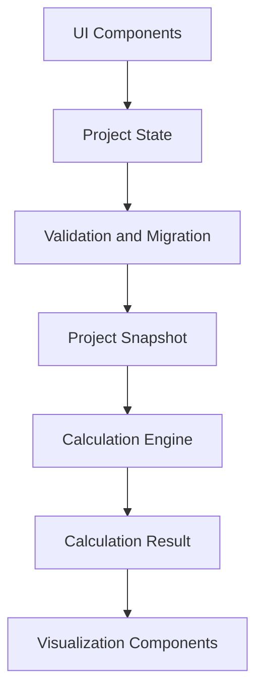
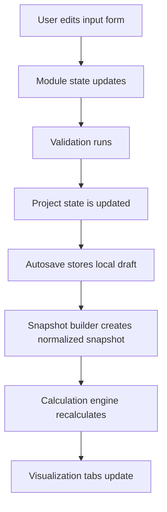
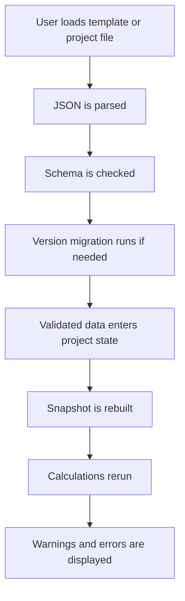

# Architecture: Real Estate Financing App

## Table of Contents

- [Purpose](#purpose)
- [Hosting Model](#hosting-model)
- [Recommended Tech Stack](#recommended-tech-stack)
- [Application Layout](#application-layout)
- [Input Tabs](#input-tabs)
- [Visualization Tabs](#visualization-tabs)
- [Layered Architecture](#layered-architecture)
- [Data Flow](#data-flow)
- [Folder Structure](#folder-structure)
- [Module Boundaries](#module-boundaries)
- [State Management](#state-management)
- [Project Snapshot](#project-snapshot)
- [Calculation Engine](#calculation-engine)
- [Persistence Layer](#persistence-layer)
- [Storage Adapter Boundary](#storage-adapter-boundary)
- [Validation Layer](#validation-layer)
- [Migration Layer](#migration-layer)
- [Error Handling](#error-handling)
- [Diagnostics](#diagnostics)
- [Routing](#routing)
- [GitHub Pages Build Constraints](#github-pages-build-constraints)
- [Responsive Behavior](#responsive-behavior)
- [Forbidden Couplings](#forbidden-couplings)
- [Implementation Principle](#implementation-principle)

---

## Purpose

This document defines the technical architecture of the **real estate financing app**.

The architecture must support:

- static hosting on GitHub Pages
- modular input tabs
- independent template files per input domain
- project manifests referencing templates
- local autosave
- JSON import/export
- optional browser file system access
- read-only visualizations
- testable calculation logic

The app must remain a **static frontend application** for the MVP.

---

## Hosting Model

The app is deployed as a static website.

**Target hosting:**

- GitHub Pages
- URL pattern:

```text
https://<user-or-org>.github.io/<repo>/
```

The app must **not** require:

- backend server
- database
- authentication
- server-side rendering
- environment secrets
- private API keys

All calculations happen in the browser.

Persistence happens through:

- IndexedDB autosave
- JSON import/export
- optional File System Access API
- optional future remote storage adapter

---

## Recommended Tech Stack

Use:

| Area | Recommendation |
|---|---|
| UI | React |
| Language | TypeScript |
| Build Tool | Vite |
| Runtime Validation | Zod or equivalent |
| Local Persistence | IndexedDB wrapper, for example Dexie or custom adapter |
| Charts | Recharts or equivalent |
| Testing | Vitest |

The app must build with:

```bash
npm run build
```

The build output must be deployable as **static assets**.

---

## Application Layout

The main UI has two columns.

```text
┌───────────────────────────────┬────────────────────────────────────┐
│ Left Column                   │ Right Column                        │
│ Input Tabs                    │ Visualization Tabs                  │
├───────────────────────────────┼────────────────────────────────────┤
│ Eignerschaft                  │ Liquidität                          │
│ Gesellschaftsform             │ Beiträge                            │
│ Capex                         │ Cashflow                            │
│ Immobilie                     │ Schulden                            │
│ Nebenkosten                   │                                    │
│ Opex                          │                                    │
└───────────────────────────────┴────────────────────────────────────┘
```

The left column edits project assumptions.

The right column displays calculated consequences.

The right column must **not** mutate project data.

---

## Input Tabs

Required input tabs:

- Eignerschaft
- Gesellschaftsform
- Capex
- Immobilie
- Nebenkosten
- Opex

Each input tab is an independent module.

Each module owns:

- its TypeScript types
- its runtime schema
- its default template
- its form component
- its validation logic
- its migration logic
- its template load/save behavior

An input tab may edit only its own part of the project state.

---

## Visualization Tabs

Required visualization tabs:

- Liquidität
- Beiträge
- Cashflow
- Schulden

Visualization tabs consume `CalculationResult`.

Visualization tabs must **not**:

- read raw form state directly
- write to the project state

They may have local UI state, for example:

- selected period
- chart aggregation
- filter
- display mode
- expanded rows

---

## Layered Architecture

Use this conceptual layering:

```text
UI Components
  ↓
Project State
  ↓
Validation and Migration
  ↓
Project Snapshot
  ↓
Calculation Engine
  ↓
Calculation Result
  ↓
Visualization Components
```



Architectural constraints:

- The UI is **not** the domain model.
- The calculation engine is **not** the persistence layer.
- The persistence layer is **not allowed** to contain business calculations.

---

## Data Flow

### Runtime Flow

```text
User edits input form
  ↓
Module state updates
  ↓
Validation runs
  ↓
Project state is updated
  ↓
Autosave stores local draft
  ↓
Snapshot builder creates normalized snapshot
  ↓
Calculation engine recalculates
  ↓
Visualization tabs update
```



### File Load Flow

```text
User loads template or project file
  ↓
JSON is parsed
  ↓
Schema is checked
  ↓
Version migration runs if needed
  ↓
Validated data enters project state
  ↓
Snapshot is rebuilt
  ↓
Calculations rerun
  ↓
Warnings/errors are displayed
```



---

## Folder Structure

Use this structure as the default.

```text
src/
  app/
    App.tsx
    layout/
      TwoColumnLayout.tsx
      InputTabs.tsx
      VisualizationTabs.tsx

  modules/
    ownership/
      schema.ts
      types.ts
      defaults.ts
      migrations.ts
      validate.ts
      OwnershipForm.tsx

    legal-form/
      schema.ts
      types.ts
      defaults.ts
      migrations.ts
      validate.ts
      LegalFormForm.tsx

    capex/
      schema.ts
      types.ts
      defaults.ts
      migrations.ts
      validate.ts
      CapexForm.tsx

    property/
      schema.ts
      types.ts
      defaults.ts
      migrations.ts
      validate.ts
      PropertyForm.tsx

    closing-costs/
      schema.ts
      types.ts
      defaults.ts
      migrations.ts
      validate.ts
      ClosingCostsForm.tsx

    opex/
      schema.ts
      types.ts
      defaults.ts
      migrations.ts
      validate.ts
      OpexForm.tsx

  calculations/
    buildProjectSnapshot.ts
    calculateAll.ts
    calculateLiquidity.ts
    calculateContributions.ts
    calculateCashflow.ts
    calculateDebt.ts
    diagnostics.ts
    rounding.ts

  persistence/
    StorageAdapter.ts
    IndexedDbAdapter.ts
    FileSystemAccessAdapter.ts
    DownloadUploadAdapter.ts
    ProjectManifest.ts
    TemplateRegistry.ts
    hashes.ts

  state/
    projectStore.ts
    autosaveStore.ts
    uiStore.ts

  ui/
    forms/
    charts/
    tables/
    buttons/
    status/
    errors/

  validation/
    commonSchemas.ts
    migrationRunner.ts
    validationErrors.ts

  utils/
    ids.ts
    dates.ts
    numbers.ts
    money.ts
```

The exact component names may evolve, but the layer boundaries must remain.

---

## Module Boundaries

Each input module must expose a small public interface.

Example:

```ts
export const ownershipModule = {
  kind: "ownership",
  schema,
  defaultTemplate,
  migrate,
  validate,
  Component: OwnershipForm,
};
```

The rest of the app should not depend on internal implementation details of the module.

### Allowed Imports

| Source | May Import |
|---|---|
| App shell | Module registry |
| Calculation layer | Validated types |
| Persistence layer | Schemas and migration functions |
| Tests | Module internals |

### Forbidden Imports

- one input form importing another input form's store
- visualization importing input form components
- calculation engine importing React components
- persistence adapter importing React components

---

## State Management

The app needs at least three state domains:

1. [Project State](#project-state)
2. [UI State](#ui-state)
3. [Autosave State](#autosave-state)

### Project State

Contains the current validated or partially validated project data.

Example:

```ts
type ProjectState = {
  ownership: OwnershipTemplate;
  legalForm: LegalFormTemplate;
  capex: CapexTemplate;
  property: PropertyTemplate;
  closingCosts: ClosingCostsTemplate;
  opex: OpexTemplate;
};
```

### UI State

Contains UI-only state.

Examples:

- selected input tab
- selected visualization tab
- expanded panels
- selected chart aggregation
- dark/light mode, if implemented

UI state should not be written into project templates unless explicitly required.

### Autosave State

Contains metadata about local draft persistence.

Examples:

- last autosave timestamp
- dirty flag
- last loaded project name
- last loaded template names
- file handle availability
- persistence mode

---

## Project Snapshot

The `ProjectSnapshot` is the normalized input to the calculation engine.

It is built from the current project state after validation and migration.

The snapshot should:

- be immutable during calculation
- contain normalized numeric values
- resolve missing defaults
- contain no React-specific state
- contain no file handles
- contain no UI-only state

Example:

```ts
type ProjectSnapshot = {
  ownership: OwnershipTemplate;
  legalForm: LegalFormTemplate;
  capex: CapexTemplate;
  property: PropertyTemplate;
  closingCosts: ClosingCostsTemplate;
  opex: OpexTemplate;
  calculatedAt: string;
};
```

---

## Calculation Engine

The calculation engine lives in:

```text
src/calculations
```

It receives a `ProjectSnapshot`.

It returns a `CalculationResult`.

Example:

```ts
type CalculationResult = {
  liquidity: LiquidityResult;
  contributions: ContributionResult;
  cashflow: CashflowResult;
  debt: DebtResult;
  diagnostics: DiagnosticMessage[];
};
```

Calculations must be deterministic.

The same snapshot must produce the same result.

No calculation function may:

- read from browser storage
- write to browser storage
- call React hooks
- depend on DOM APIs
- mutate input templates
- depend on file handles

---

## Persistence Layer

The persistence layer lives in:

```text
src/persistence
```

It owns:

- template loading
- template saving
- project loading
- project saving
- JSON import/export
- IndexedDB autosave
- File System Access API integration
- future storage adapters

Persistence is accessed through a storage adapter interface.

The rest of the app must not call browser file APIs directly.

---

## Storage Adapter Boundary

Use an adapter interface similar to:

```ts
export type StorageAdapter = {
  name: string;

  capabilities: {
    directSave: boolean;
    directoryAccess: boolean;
    projectPackage: boolean;
    remoteSync: boolean;
  };

  loadTemplate<T>(kind: TemplateKind): Promise<TemplateFile<T>>;
  saveTemplate<T>(file: TemplateFile<T>): Promise<void>;
  saveTemplateAs<T>(file: TemplateFile<T>): Promise<TemplateRef>;

  loadProject(): Promise<ProjectManifest>;
  saveProject(project: ProjectManifest): Promise<void>;
  saveProjectAs(project: ProjectManifest): Promise<ProjectRef>;
};
```

Concrete adapters may include:

- `IndexedDbAdapter`
- `DownloadUploadAdapter`
- `FileSystemAccessAdapter`
- future `GithubRepoAdapter`

---

## Validation Layer

Every imported file must be validated before it enters the project state.

Validation must check:

- JSON parseability
- expected schema identifier
- supported version
- required fields
- numeric ranges
- owner share consistency
- references between project and templates
- migration compatibility

Invalid files must produce visible errors.

The app must not silently accept malformed data.

---

## Migration Layer

Each persisted file has a version.

When a file is loaded:

```text
parse
  ↓
identify schema
  ↓
identify version
  ↓
migrate to current version
  ↓
validate
  ↓
use
```

Do not remove migration code without a deliberate breaking-change decision.

Old projects should remain loadable where reasonably possible.

---

## Error Handling

Errors should be classified.

Required categories:

| Category | Notes |
|---|---|
| validation error | Invalid or incomplete data |
| migration error | Data cannot be upgraded to the current schema |
| missing template | Project references a template that cannot be found |
| changed template hash | Referenced template changed since the project was saved |
| calculation warning | Calculation completed but produced warnings |
| persistence error | Save/load operation failed |
| unsupported browser capability | Required browser API is unavailable |
| user-cancelled file operation | User cancelled a file picker or save dialog |

User-cancelled file operations should not be treated as fatal errors.

---

## Diagnostics

The calculation engine should return diagnostics instead of hiding problems.

Examples:

- owner shares do not sum to 100%
- negative liquidity occurs in month 8
- closing costs exceed available equity
- missing interest rate assumption
- unsupported legal form assumption
- contribution rule references unknown owner

Diagnostics should be visible in the UI.

---

## Routing

The MVP does not require multi-page routing.

Prefer a single-page app.

Optional URL state may be added later for:

- active input tab
- active visualization tab
- demo project selection

Do not depend on backend routing.

For GitHub Pages, ensure the Vite base path is configured correctly.

---

## GitHub Pages Build Constraints

The app must work after static build.

Do not rely on:

- server-side redirects
- dynamic server routes
- backend environment variables
- filesystem access on the server
- Node.js at runtime

Runtime code runs in the browser only.

---

## Responsive Behavior

### Desktop Layout

- two columns
- input left
- visualization right

### Small Screens

- stacked layout is acceptable
- tabs remain accessible
- no horizontal overflow for forms
- tables may scroll horizontally

The MVP should prioritize desktop usability.

---

## Forbidden Couplings

Do not introduce these couplings:

| Forbidden Coupling | Reason |
|---|---|
| Input Form → Other Input Form | Input modules must remain independent |
| Input Form → Visualization Tab | Inputs must not depend on output rendering |
| Visualization Tab → Project Mutation | Visualizations are read-only |
| Calculation Engine → React | Calculations must remain testable and deterministic |
| Calculation Engine → Browser Storage | Calculations must not depend on persistence |
| Persistence Adapter → React Component | Persistence must remain UI-independent |
| Schema Module → UI Component | Schemas must stay reusable outside React |
| GitHub Pages Deployment → Runtime Data Persistence | Static hosting must not define persistence behavior |

---

## Implementation Principle

Prefer explicit data flow over convenience.

If a value appears in a chart, it must be traceable back to:

```text
input template
  ↓
validated project state
  ↓
project snapshot
  ↓
calculation function
  ↓
result field
  ↓
visualization component
```

---

## Implementation Status: Interactive Financing And Reserve Scaffold

As of 2026-05-15, the repository contains an interactive static app scaffold.

Implemented:

- npm/Vite/React/TypeScript/Vitest setup under `simTool`.
- GitHub Pages production base path `/RenntnerHazienda/`.
- v1 Zod schemas, defaults, validation, and identity migrations for all template modules.
- Visible input modules are `ownership`, `legalForm`, `property`, and `opex`.
- Internal compatibility modules `capex`, `closingCosts`, and `financing` remain part of project state and JSON persistence.
- Financing is shown in the `Immobilie` tab but remains a separate project-state/template module.
- Closing costs and renovation items are edited through the `property` module.
- Interactive slider plus number inputs update React project state; snapshots, calculations, tables, and charts recalculate automatically.
- JSON upload/download fallback for project load/save/export and visible template load/save/export.
- Contribution, cashflow, liquidity, and annuity debt calculations with debt principal derived from project need minus owner equity.
- Six default owners with different equity contributions; ownership shares are derived from total owner equity.
- Yearly reserve contributions are calculated so liquidity remains above the configured reserve target where owner equity is available.
- Two-column app shell with input tabs, visualization tabs, diagnostics panel, status badges, and Recharts charts/tables.

Explicitly not implemented yet:

- IndexedDB autosave persistence.
- Direct file overwrite through File System Access API.
- ZIP import/export.
- User-approved overwrite/conflict workflows.

Local verification commands:

```bash
npm run lint
npm run typecheck
npm test
npm run build
```

Next architecture steps:

- Implement IndexedDB autosave behind the existing storage boundary.
- Add direct-save support as an adapter on top of the current JSON fallback.
- Add richer import/export conflict workflows and optional direct file overwrite support.
