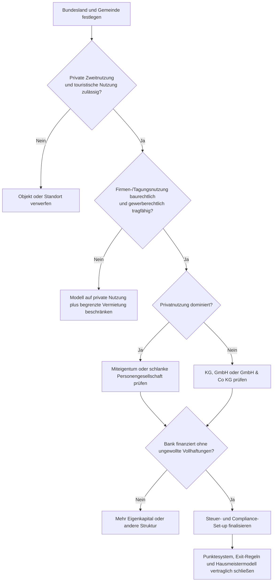
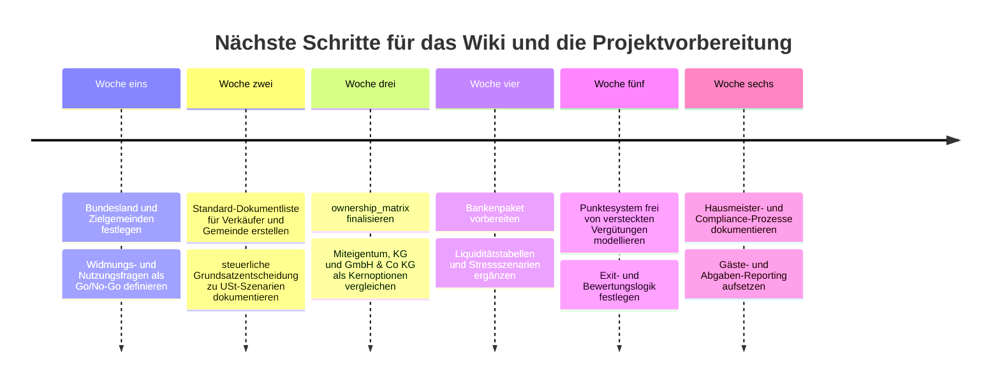

# 01_overall.md

# Gesamtüberblick

## 1. Zweck der Informationssammlung

### Kernaussage
Dieses Wiki sammelt allgemeine Informationen zu rechtlichen, steuerlichen, organisatorischen, finanziellen und operativen Aspekten eines gemeinschaftlich genutzten Ferienhauses in Österreich.

### Geltungsbereich
- Land: Österreich
- Objektart: Ferienhaus, Freizeitwohnsitz, touristisch vermietbare Unterkunft
- Nutzerkreis: mehrere private oder institutionelle Beteiligte
- Keine Beschränkung auf eine konkrete Immobilie
- Keine Festlegung auf eine bestimmte Rechtsform

### Quelle
- Quelle: Projektinterne Definition
- Herausgeber: Projektteam
- Link: intern
- Stand/Veröffentlichungsdatum: laufend
- Abrufdatum: 2026-05-15
- Geltungsbereich: Wiki-interne Arbeitsdefinition
- Stabilität: mittel
- Aktualisierung nötig bei: Änderung des Projektzwecks, Änderung der Eigentümerziele

## 2. Grundprinzip

Diese Informationssammlung trennt strikt zwischen:
- allgemein gültigen Informationen,
- bundeslandspezifischen Regeln,
- gemeindeabhängigen Regelungen,
- objektbezogenen Prüfpunkten,
- steuerlicher oder rechtlicher Einzelfallberatung.

Konkrete Entscheidungen zu Kauf, Finanzierung, Umsatzsteuer, Rechtsform oder Nutzung müssen später anhand des Einzelfalls geprüft werden.

### Quelle
- Quelle: Redaktionsstandard / DeepResearch-Prüflogik
- Herausgeber: Projektteam
- Link: ../AGENTS.md
- Link: ../references/260515-DeepResearch1
- Stand/Veröffentlichungsdatum: 2026-05-15
- Abrufdatum: 2026-05-15
- Geltungsbereich: Wiki-interne Arbeitsregel
- Stabilität: mittel

## 3. Zentrale Begriffe

| Begriff | Arbeitsdefinition | Prüfpunkte |
|---|---|---|
| Ferienhaus | Gebäude oder Einheit, die für Ferien-/Erholungszwecke genutzt wird | baurechtliche Zulässigkeit, Widmung, touristische Vermietbarkeit |
| Freizeitwohnsitz | Wohnsitz, der nicht Mittelpunkt der Lebensbeziehungen ist, sondern insbesondere Erholungszwecken dient | Landesrecht, Gemeinde, Registrierung |
| touristische Vermietung | entgeltliche kurzfristige Überlassung an Gäste | Meldepflichten, Ortstaxe/Aufenthaltsabgabe, Umsatzsteuer |
| Beherbergung | Unterkunftsleistung, ggf. mit Nebenleistungen | Gewerberecht, Umsatzsteuer, Gästemeldung |
| Eigennutzung | Nutzung durch Eigentümer oder nahestehende Personen | Steuer, Umsatzsteuer, Fremdüblichkeit |
| Miteigentum | mehrere Personen sind anteilig Eigentümer einer Liegenschaft | Grundbuch, Nutzungsvereinbarung, Finanzierung |
| Gesellschaftsform | rechtlicher Rahmen für Besitz, Nutzung, Finanzierung und Vermietung | Haftung, Steuer, Bankfähigkeit |

### Quelle
- Quelle: Quellenregister dieses Wikis; Begriffsverwendung aus Rechts-, Steuer- und Tourismusquellen
- Herausgeber: Projektteam; externe Herausgeber siehe Quellenregister
- Link: ../references/260515-DeepResearch1
- Stand/Veröffentlichungsdatum: 2026-05-15
- Abrufdatum: 2026-05-15
- Geltungsbereich: Wiki-interne Arbeitsdefinitionen für Österreich
- Stabilität: mittel

## 4. Grundsätzliche Entscheidungsfelder

| Feld | Allgemeine Leitfrage |
|---|---|
| Rechtliche Zulässigkeit | Darf das Objekt als Ferienhaus, Freizeitwohnsitz oder touristische Unterkunft genutzt werden? |
| Steuerliche Behandlung | Welche Steuern und Abgaben entstehen bei Kauf, Besitz, Nutzung und Vermietung? |
| Eigentümerstruktur | Wie werden Eigentum, Haftung, Entscheidungen, Austritt und Nachschüsse organisiert? |
| Finanzierung | Wer ist Kreditnehmer, welche Sicherheiten gibt es, wie wird die Tragfähigkeit nachgewiesen? |
| Nutzungskonzept | Wie werden Eigennutzung und Fremdvermietung abgegrenzt? |
| Laufender Betrieb | Wer organisiert Reinigung, Verwaltung, Meldungen, Abrechnung und Instandhaltung? |
| Wirtschaftlichkeit | Welche laufenden Kosten, Einnahmen und Rücklagen sind realistisch? |

### Quelle
- Quelle: DeepResearch-Prüflogik
- Herausgeber: Projektteam
- Link: ../references/260515-DeepResearch1
- Stand/Veröffentlichungsdatum: 2026-05-15
- Abrufdatum: 2026-05-15
- Geltungsbereich: Wiki-interne Strukturierung
- Stabilität: mittel

## 5. Quellenregister

| ID | Thema | Quelle | Herausgeber | Link | Stand/Veröffentlichungsdatum | Abrufdatum | Geltungsbereich | Stabilität |
|---|---|---|---|---|---|---|---|---|
| Q001 | Kaufnebenkosten | Nebenkosten beim Wohnungs- und Grundstückskauf | oesterreich.gv.at | https://www.oesterreich.gv.at/de/themen/bauen_und_wohnen/wohnen/8/Seite.210150 | Website, laufend aktualisiert | 2026-05-15 | Österreich | mittel |
| Q002 | Grunderwerbsteuer-Bemessung | Bemessungsgrundlage | Bundesministerium für Finanzen | https://www.bmf.gv.at/themen/steuern/immobilien-grundstuecke/grunderwerbsteuer/bemessungsgrundlage.html | Website, publiziert 2026 | 2026-05-15 | Österreich | mittel |
| Q003 | Umsatzsteuersätze | Steuersätze und Steuerbefreiungen der Umsatzsteuer | Unternehmensserviceportal / BMF | https://www.usp.gv.at/themen/steuern-finanzen/umsatzsteuer-ueberblick/steuersaetze-und-steuerbefreiungen-der-umsatzsteuer.html | Website, laufend aktualisiert | 2026-05-15 | Österreich | mittel |
| Q004 | Umsatzsteuer allgemein | Umsatzsteuer Überblick | Unternehmensserviceportal / BMF | https://www.usp.gv.at/themen/steuern-finanzen/umsatzsteuer-ueberblick/ | Januar 2026 | 2026-05-15 | Österreich | mittel |
| Q005 | GesbR | Gesellschaft bürgerlichen Rechts | WKO | https://www.wko.at/wirtschaftsrecht/gesellschaft-buergerliches-recht-gesbr | Website, 2026 | 2026-05-15 | Österreich | mittel |
| Q006 | KG | Kommanditgesellschaft | WKO | https://www.wko.at/wirtschaftsrecht/kommanditgesellschaft-kg | Stand 05.09.2025 | 2026-05-15 | Österreich | mittel |
| Q007 | GmbH | Gesellschaft mit beschränkter Haftung | WKO | https://www.wko.at/wirtschaftsrecht/gesellschaft-mit-beschraenkter-haftung-gmbh | Website, laufend aktualisiert | 2026-05-15 | Österreich | mittel |
| Q008 | Körperschaftsteuer | Körperschaftsteuer | WKO | https://www.wko.at/steuern/koest-koerperschaftsteuer | Website, laufend aktualisiert | 2026-05-15 | Österreich | mittel |
| Q009 | Aufenthaltsabgabe Tirol | Aufenthaltsabgaben | Land Tirol | https://www.tirol.gv.at/tourismus/aufenthaltsabgabe/ | Website, laufend aktualisiert | 2026-05-15 | Tirol | niedrig/mittel |
| Q010 | Freizeitwohnsitzabgabe Tirol | Leitfaden TFLAG 2025 | Land Tirol | https://www.tirol.gv.at/fileadmin/themen/tirol-europa/gemeinden/downloads/Leitfaden_zum_TFLAG_2025_inklusive.pdf | 2025 | 2026-05-15 | Tirol | niedrig/mittel |
| Q011 | Freizeitwohnsitzpauschale | Freizeitwohnsitzpauschale / Freizeitwohnsitzabgabe | Land Tirol | https://www.tirol.gv.at/fileadmin/themen/tirol-europa/gemeinden/downloads/Freizeitwohnsitzpauschale_-Freizeitwohnsitzabgabe.pdf | PDF, laufend zu prüfen | 2026-05-15 | Tirol | niedrig |
| Q012 | Freizeitwohnsitzverzeichnis | Freizeitwohnsitzverzeichnis | Land Tirol | https://statistik.tirol.gv.at/homepage/freizeitwohnsitze/ | 03.04.2026 | 2026-05-15 | Tirol | niedrig |
| Q013 | Vermietung / Beherbergung | Vermietung und Beherbergung | WKO | https://www.wko.at/oe/tourismus-freizeitwirtschaft/hotellerie/vermietung-beherbergung.pdf | PDF, laufend zu prüfen | 2026-05-15 | Österreich | mittel |
| Q014 | Flächenwidmung / Bebauungsplan | Flächenwidmungs- und Bebauungspläne | oesterreich.gv.at | https://www.oesterreich.gv.at/de/themen/bauen_und_wohnen/grundstueckskauf_und_grundbuch/grundstueckskauf/Seite.200030 | Website, laufend aktualisiert | 2026-05-15 | Österreich, Gemeindeebene | mittel |
| Q015 | Zimmervermietung / Gewerberecht | Zimmervermietung und Gewerberecht | oesterreich.gv.at | https://www.oesterreich.gv.at/de/themen/reisen_und_freizeit/reisen-und-ferien/7/Seite.2960406 | Letzte Aktualisierung laut Website 2025/2026, laufend zu prüfen | 2026-05-15 | Österreich | mittel |
| Q016 | Gästeverzeichnis | Gästeblattsammlung/Gästeverzeichnis | oesterreich.gv.at | https://www.oesterreich.gv.at/de/lexicon/G/Seite.991691 | Letzte Aktualisierung 01.01.2026 | 2026-05-15 | Österreich | mittel |
| Q017 | USt-Option Vermietung | Option zur Steuerpflicht bei Vermietung und Verpachtung von Grundstücken | Bundesministerium für Finanzen | https://www.bmf.gv.at/themen/steuern/fuer-unternehmen/umsatzsteuer/informationen/option-zur-steuerpflicht-bei-vermietung-und-verpachtung-von-grundstuecken-sowie-bei-leistungen-von-wohnungseigentumsgemeinschaften.html | Website, laufend aktualisiert | 2026-05-15 | Österreich | mittel |
| Q018 | Vorsteuerberichtigung Grundstücke | Vorsteuerberichtigungszeitraum bei Grundstücken | Bundesministerium für Finanzen | https://www.bmf.gv.at/themen/steuern/fuer-unternehmen/umsatzsteuer/informationen/vorsteuerberichtigungszeitraum_bei_Grundst%C3%BCcken.html | Letzte Aktualisierung 12.02.2025 | 2026-05-15 | Österreich | mittel |
| Q019 | USt Vermietung/Verpachtung | Vermietung und Verpachtung in der Umsatzsteuer | Bundesministerium für Finanzen | https://www.bmf.gv.at/themen/steuern/immobilien-grundstuecke/vermietung-verpachtung/vermietung-und-verpachtung-in-der-umsatzsteuer.html | Website, Stand 2026 | 2026-05-15 | Österreich | mittel |
| Q020 | Grundsteuer | Grundsteuer | Bundesministerium für Finanzen | https://www.bmf.gv.at/themen/steuern/immobilien-grundstuecke/grundbesitzabgaben-einheitsbewertung/grundsteuer.html | Website, Stand 2026 | 2026-05-15 | Österreich / Gemeinden | mittel |
| Q021 | DBA Deutschland Art. 6 | DBA Österreich-Deutschland, Art. 6 | RIS / Bundeskanzleramt | https://www.ris.bka.gv.at/eli/bgbl/iii/2002/182/A6/NOR40034867 | BGBl. III Nr. 182/2002, konsolidierte Fassung | 2026-05-15 | Österreich / Deutschland | mittel |
| Q022 | DBA Schweiz Art. 6 | DBA Österreich-Schweiz, Art. 6 | RIS / Bundeskanzleramt | https://ris.bka.gv.at/eli/bgbl/1975/64/A6/NOR12046358 | BGBl. Nr. 64/1975, konsolidierte Fassung | 2026-05-15 | Österreich / Schweiz | mittel |
| Q023 | Wohnimmobilienkredite | KIM-V-Ende / FMA-Erwartung solide Kreditvergabe | Finanzmarktaufsicht Österreich | https://www.fma.gv.at/kim-v-ende-fma-erwartet-stabile-kreditvergabe/ | 26.06.2025 | 2026-05-15 | Österreich | niedrig/mittel |
| Q024 | Bankpraxis Eigenmittel | Eigenmittel / Immobilienkredit-Informationen | Raiffeisen / Bank Austria | https://www.raiffeisen.at/noew/rlb/de/privatkunden/kredit-leasing/wohnfinanzierung/eigenmittel.html und https://www.bankaustria.at/privatkunden-stories-das-1x1-des-immobilienkredits.jsp | Websites, laufend zu prüfen | 2026-05-15 | Österreich, bankabhängig | niedrig |
| Q025 | OG | Offene Gesellschaft | WKO | https://www.wko.at/wirtschaftsrecht/offene-gesellschaft-og- | Stand 24.10.2025 | 2026-05-15 | Österreich | mittel |
| Q026 | GmbH & Co KG | GmbH & Co KG | WKO | https://www.wko.at/wirtschaftsrecht/gmbh-und-co-kg | Stand 05.09.2025 / laufend zu prüfen | 2026-05-15 | Österreich | mittel |
| Q027 | Besteuerung Personengesellschaften | Besteuerung von Personengesellschaften | WKO | https://www.wko.at/steuern/besteuerung-personengesellschaften | Website, Stand 2026 | 2026-05-15 | Österreich | mittel |
| Q028 | Verein | Vereinswesen / Grundsätzliches | Bundesministerium für Inneres | https://www.bmi.gv.at/609/grundsaetzliches.aspx | Website, laufend aktualisiert | 2026-05-15 | Österreich | mittel |
| Q029 | Gewerbeanmeldung | Gewerbeanmeldung | Unternehmensserviceportal | https://www.usp.gv.at/gruendung/EAP/gewerbeanmeldung.html | Website, laufend aktualisiert | 2026-05-15 | Österreich | mittel |
| Q030 | Geringfügigkeit | Geringfügigkeit | Österreichische Gesundheitskasse | https://www.gesundheitskasse.at/cdscontent/?contentid=10007.904882&portal=oegkdgportal | Stand 01.01.2026 | 2026-05-15 | Österreich | niedrig/mittel |
| Q031 | Dienstleistungsscheck | Informationen für ArbeitgeberInnen zum Dienstleistungsscheck | Dienstleistungsscheck-Online / BVAEB | https://www.dienstleistungsscheck-online.at/dienstleistungsscheck-webapp/about/arbeitgeber.jsf | Website, laufend aktualisiert | 2026-05-15 | Österreich | niedrig/mittel |
| Q032 | WiEReG | Register der wirtschaftlichen Eigentümer | Bundesministerium für Finanzen | https://www.bmf.gv.at/services/wiereg/wiereg-register.html | Website, laufend aktualisiert | 2026-05-15 | Österreich | mittel |
| Q033 | AfA Vermietung | Absetzung für Abnutzung bei Vermietung und Verpachtung | Bundesministerium für Finanzen | https://www.bmf.gv.at/themen/steuern/immobilien-grundstuecke/vermietung-verpachtung/absetzung-fuer-abnutzung-bei-vuv.html | Website, Stand 2026 | 2026-05-15 | Österreich | mittel |
| Q034 | Liebhaberei | Liebhabereiverordnung § 2 | RIS / Bundeskanzleramt | https://www.ris.bka.gv.at/NormDokument.wxe?Abfrage=Bundesnormen&Gesetzesnummer=10004804&Paragraf=2 | konsolidierte Rechtsvorschrift, laufend zu prüfen | 2026-05-15 | Österreich | mittel |
| Q035 | Tirol Vermietungsleitfaden | Leitfaden zum Vermieten meiner Wohnung | Land Tirol | https://www.tirol.gv.at/fileadmin/themen/tourismus/tourismusabteilung/Aufenthaltsabgaben/Leitfaden_zum_Vermieten_meiner_Wohnung.pdf | PDF, laufend zu prüfen | 2026-05-15 | Tirol | niedrig/mittel |
| Q036 | Freizeitwohnsitzpauschale/-abgabe | Freizeitwohnsitzpauschale / Freizeitwohnsitzabgabe | Land Tirol | https://www.tirol.gv.at/fileadmin/themen/tourismus/tourismusabteilung/Aufenthaltsabgaben/Freizeitwohnsitzpauschale_-_Freizeitwohnsitzabgabe.pdf | PDF, laufend zu prüfen | 2026-05-15 | Tirol | niedrig |

### Quelle
- Quelle: Wiki-Quellenregister
- Herausgeber: Projektteam
- Link: ../AGENTS.md
- Stand/Veröffentlichungsdatum: 2026-05-15
- Abrufdatum: 2026-05-15
- Geltungsbereich: Projektinterne Quellenverwaltung
- Stabilität: mittel

## 6. Datenqualitätsstufen

| Stufe | Bedeutung | Beispiele |
|---|---|---|
| A | Primärquelle | Gesetz, Verordnung, Ministerium, Landesregierung, Gemeinde, RIS |
| B | Institutionelle Sekundärquelle | WKO, Notariatskammer, Steuerberaterkammer, USP |
| C | Fachliche Sekundärquelle | Steuerkanzlei, Rechtsanwaltskanzlei, Bank, Versicherung |
| D | unbestätigt | Maklerangabe, mündliche Aussage, Forum, KI-Zusammenfassung |

Regel: Rechtliche, steuerliche und finanzielle Kernaussagen sollen möglichst auf Stufe A oder B beruhen.

### Quelle
- Quelle: Redaktionsstandard
- Herausgeber: Projektteam
- Link: ../AGENTS.md
- Stand/Veröffentlichungsdatum: 2026-05-15
- Abrufdatum: 2026-05-15
- Geltungsbereich: Wiki-interne Qualitätssicherung
- Stabilität: mittel

## 7. Allgemeiner Arbeitsablauf für spätere Einzelfallprüfung

1. Objektstatus rechtlich prüfen.
2. Nutzungsmöglichkeiten schriftlich bei Gemeinde/Land klären.
3. Kaufpreis und Umsatzsteuerbehandlung prüfen.
4. Erwerbsnebenkosten und Liquiditätsbedarf berechnen.
5. Gesellschafts-/Eigentümerstruktur vergleichen.
6. Finanzierung mit mehreren Strukturvarianten vorbereiten.
7. Nutzungs- und Vermietungskonzept definieren.
8. Steuerliche Behandlung der Eigennutzung und Fremdvermietung prüfen.
9. Betriebskosten, Rücklagen und Wirtschaftlichkeit modellieren.
10. Verträge und Beschlüsse erstellen lassen.

### Quelle
- Quelle: DeepResearch-Prüflogik
- Herausgeber: Projektteam
- Link: ../references/260515-DeepResearch1
- Stand/Veröffentlichungsdatum: 2026-05-15
- Abrufdatum: 2026-05-15
- Geltungsbereich: Wiki-interner Arbeitsablauf
- Stabilität: mittel

## 8. DeepResearch-Prüflogik

### Kernaussage
Für ein gemeinschaftliches Ferienhaus mit vier bis zehn Beteiligten, überwiegender Eigennutzung, begrenzter Vermietung an Freunde oder bekannte Unternehmen und gelegentlichen Firmenaufenthalten ist die erste Leitfrage nicht die Steueroptimierung, sondern die rechtliche Zulässigkeit der geplanten Nutzung. Nutzung, Steuer, Eigentümerstruktur und Finanzierung sind in dieser Reihenfolge zu prüfen.

### Geltungsbereich
- Land: Österreich
- Bundesland/Gemeinde: offen; Tirol dient wegen der strengen Freizeitwohnsitzregeln als restriktives Referenzmodell
- Nutzung: Eigennutzung, touristische Vermietung, Firmenaufenthalte, punktuelle Tagungsnutzung
- Charakter: allgemeine Projektlogik, keine Objektprüfung

### Quelle
- Quelle: DeepResearch-Referenz und Primärquellenbasis dieses Wikis
- Herausgeber: Projektteam; externe Quellen siehe Q014, Q015, Q017, Q018, Q023, Q035
- Link: ../references/260515-DeepResearch1
- Stand/Veröffentlichungsdatum: 2026-05-15
- Abrufdatum: 2026-05-15
- Geltungsbereich: Österreich allgemein; Tirol als Landesbeispiel
- Stabilität: mittel
- Aktualisierung nötig bei: Standortfestlegung, Gemeindeauskunft, Gesetzesänderung, Bankanfrage

### Arbeitsannahmen
| Thema | Arbeitsannahme | Bedeutung für das Wiki |
|---|---|---|
| Nutzung | private Hauptmotivation, ergänzende Vermietung | Mischnutzung ist rechtlich und umsatzsteuerlich der größte Komplexitätstreiber. |
| Bundesland/Gemeinde | offen; Tirol als restriktives Referenzmodell | Raumordnung, Baurecht, Grundverkehr und viele Tourismusabgaben sind lokal bzw. landesrechtlich geprägt. |
| Servicelevel | minimal | Nebenleistungen können aus bloßer Vermietung eine gewerberechtlich relevante Beherbergung machen. |
| Eigentümerbeiträge | ungleich, teilweise Arbeit statt Geld | Die Binnenordnung braucht robuste Regeln für Kapitalkonten, Arbeitspunkte, Nachschüsse und Exit. |
| Haftungspräferenz | begrenzte persönliche Garantien gewünscht | Diese Präferenz kann mit Bankpraxis bei kleinen Immobiliengesellschaften kollidieren. |
| Vermarktung | begrenzt, nicht öffentlich forciert | Das reduziert gewerberechtlichen Druck, beseitigt ihn aber nicht sicher. |

## 9. Killer Questions

### Kernaussage
Die folgenden Fragen sind Go/No-Go-Fragen. Detailoptimierungen sind erst sinnvoll, wenn diese Punkte belastbar beantwortet sind.

### Quelle
- Quelle: DeepResearch-Referenz; rechtliche/steuerliche/finanzielle Basisquellen Q014, Q015, Q017, Q018, Q021, Q022, Q023, Q025-Q031, Q035
- Herausgeber: Projektteam; externe Herausgeber siehe Quellenregister
- Link: ../references/260515-DeepResearch1
- Stand/Veröffentlichungsdatum: 2026-05-15
- Abrufdatum: 2026-05-15
- Geltungsbereich: Österreich allgemein; Deutschland/Schweiz nur für DBA-Grundlogik
- Stabilität: mittel

1. Darf die konkrete Liegenschaft im gewählten Bundesland und in der Gemeinde privat, touristisch und punktuell für Firmen genutzt werden?
2. Gibt es eine tragfähige Grundlage für private Zweitnutzung, oder ist nur touristische Beherbergung zulässig?
3. Wird durch Eigennutzung jeder nennenswerte Vorsteuerhebel wirtschaftlich zerstört oder stark eingeschränkt?
4. Akzeptiert die Eigentümergruppe persönliche Haftung oder Bürgschaften, oder soll die Struktur diese gerade begrenzen?
5. Finanziert eine Bank die gewählte Struktur ohne unerwünschte Vollbesicherung durch Gesellschafter?
6. Ist der Exit-Mechanismus vollständig geregelt: Bewertung, Aufgriffsrechte, Zahlungsfristen, Tod, Scheidung, Insolvenz und Ausfall eines Eigentümers?
7. Steuert das Punktesystem nur Nutzung, oder ersetzt es faktisch Arbeitsentgelt, Kapitalverzinsung oder verdeckte Mietzahlungen?
8. Ist der Hausmeisterfall arbeitsrechtlich lösbar, ohne Dienstleistungsscheck-Missbrauch, Sachbezugsprobleme oder Mischverwendung?
9. Sind in Deutschland oder der Schweiz steuerlich ansässige Beteiligte bereit, österreichische Steuer- und Erklärungspflichten sowie Folgeerklärungen im Ansässigkeitsstaat zu tragen?
10. Bleibt das Projekt attraktiv, wenn Fremdvermietung nur moderat funktioniert und die Eigentümer dauerhaft Fixkosten zuschießen müssen?

## 10. Entscheidungsfluss

### Kernaussage
Der Entscheidungsfluss bildet die im DeepResearch-Bericht vorgeschlagene Reihenfolge ab: Standort- und Nutzungszulässigkeit vor Steuer, Rechtsform und Finanzierung.

### Quelle
- Quelle: DeepResearch-Referenz; Quellenregister Q014, Q015, Q017, Q018, Q023, Q025-Q027, Q035
- Herausgeber: Projektteam; externe Herausgeber siehe Quellenregister
- Link: ../references/260515-DeepResearch1
- Stand/Veröffentlichungsdatum: 2026-05-15
- Abrufdatum: 2026-05-15
- Geltungsbereich: Österreich allgemein
- Stabilität: mittel

## 11. Nächste Arbeitspakete

### Kernaussage
Die weitere Recherche sollte vom Standort zur Struktur und erst danach zur Detailoptimierung laufen.

### Quelle
- Quelle: DeepResearch-Referenz
- Herausgeber: Projektteam
- Link: ../references/260515-DeepResearch1
- Stand/Veröffentlichungsdatum: 2026-05-15
- Abrufdatum: 2026-05-15
- Geltungsbereich: Wiki-interne Arbeitsplanung
- Stabilität: mittel

## 12. Grenzen dieser Sammlung

### Kernaussage
Drei Punkte bleiben ohne Objekt- und Standortbezug offen: die konkrete landes- und gemeinderechtliche Zulässigkeit der Mischverwendung, die tatsächliche Vorsteuerfähigkeit des genauen Privat-/Firmen-Nutzungsmixes und die Finanzierbarkeit ohne persönliche Garantien. Diese Punkte sind zuerst mit Gemeinde/Baubehörde, Notar, Steuerberater und Bank zu klären.

### Quelle
- Quelle: DeepResearch-Referenz; externe Basisquellen Q014, Q017, Q018, Q023, Q035
- Herausgeber: Projektteam; externe Herausgeber siehe Quellenregister
- Link: ../references/260515-DeepResearch1
- Stand/Veröffentlichungsdatum: 2026-05-15
- Abrufdatum: 2026-05-15
- Geltungsbereich: Österreich allgemein
- Stabilität: mittel

## 13. Wiki-Integrationsprioritäten

### Kernaussage
Die DeepResearch-Inhalte sind nach Dringlichkeit in die fachlichen Wiki-Dateien zu verteilen. Vorrang haben die Standort-/Nutzungszulässigkeit, die USt- und Abgabenlogik sowie die Eigentümer- und Exit-Struktur.

### Quelle
- Quelle: DeepResearch-Referenz
- Herausgeber: Projektteam
- Link: ../references/260515-DeepResearch1
- Stand/Veröffentlichungsdatum: 2026-05-15
- Abrufdatum: 2026-05-15
- Geltungsbereich: Wiki-interne Arbeitsplanung
- Stabilität: mittel

| Priorität | Wiki-Datei | Zu dokumentieren |
|---|---|---|
| sofort | 02_legal.md | Landes- und Gemeindelogik: Widmung, Bebauung, Freizeitwohnsitz, touristische Nutzung, Tagungsnutzung, Zuständigkeiten, schriftliche Bestätigungen |
| sofort | 03_tax.md | Kauf-USt-Entscheidungsbaum, Vorsteuerfähigkeit, 20-Jahres-Berichtigung, USt-Sätze je Leistung, GrESt, Grundsteuer, Aufenthaltsabgaben, DBA-Basislogik |
| sofort | 04_ownership.md | ownership_matrix, Beteiligungs- und Exit-Regime, Rollenmodell, Beschlussfassungen |
| hoch | 05_finance.md | Bankanforderungen, Eigenkapitalbedarf, Bürgschaftsfragen, Liquiditätstabellen, Stressszenarien |
| hoch | 06_usage.md | Punktesystemvarianten, Buchungslogik, Sperrzeiten, Fremdvermietungsfreigaben, owner-affiliated company usage |
| hoch | 07_operational.md | Fixkostenmodell, Deckungsbeiträge, Hausmeistervarianten, Compliance-Prozesse, Gästemeldung, Tourismusabgaben |
| ergänzend | 01_overall.md | Entscheidungsbaum, Definitionen, Projektprämissen, Killer Questions, Quellenbasis |
